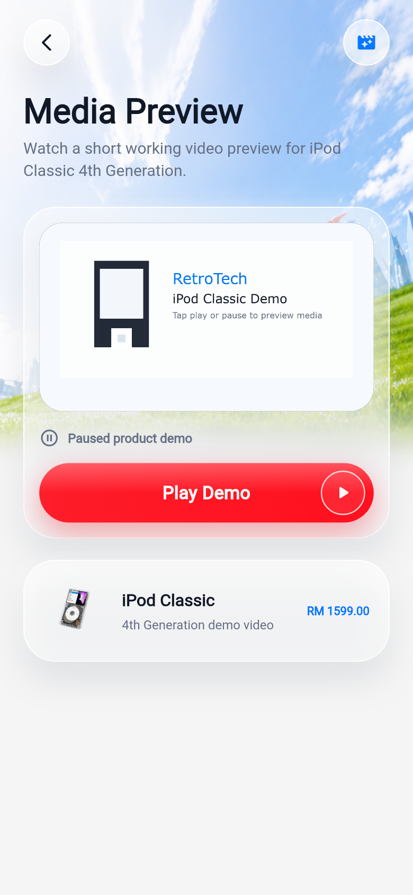
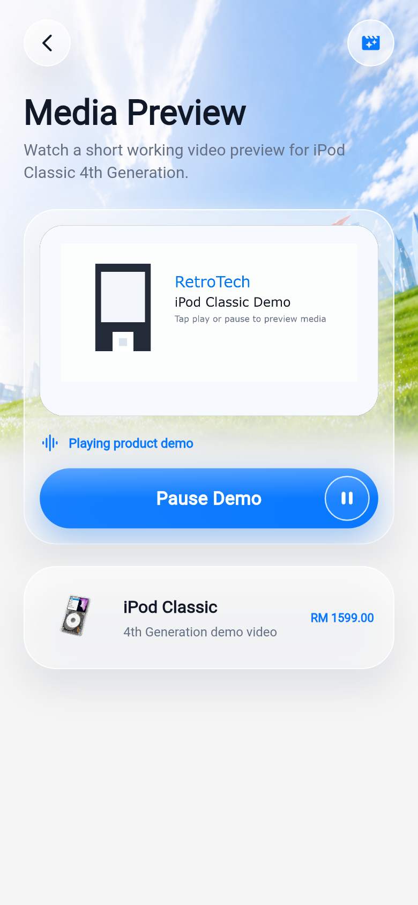

# Multimedia Feature

## What Was Added

RetroTech Marketplace now includes a working multimedia playback screen for product previews. The feature is connected from the Product Detail screen through the **Product Demo** card. Tapping the card opens the **Media Preview** screen for the selected listing.

## Screenshots

| Paused State | Playing State |
| --- | --- |
|  |  |

## Code Explanation

- `lib/screens/product/product_detail_screen.dart` adds `MultimediaPreviewTile`, a Product Detail card that calls `Navigator.pushNamed(context, '/multimedia', arguments: item)` so the media screen receives the current product listing.
- `lib/app.dart` registers the `/multimedia` route and builds `MultimediaScreen` with the `Listing` argument.
- `lib/screens/product/multimedia_screen.dart` contains the playback screen. `AssetMultimediaPlayer` wraps `VideoPlayerController.asset(Assets.ipodDemoVideo)`, initializes the local MP4 asset, enables looping, and exposes real `play()` and `pause()` methods.
- The play/pause button calls `_togglePlayback()`. When the video is paused, it calls `play()` and updates the UI to **Playing product demo** / **Pause Demo**. When the video is playing, it calls `pause()` and updates the UI back to **Paused product demo** / **Play Demo**.
- `pubspec.yaml` adds the official `video_player` package and registers `assets/videos/`, while `lib/constants/assets.dart` stores the local video path as `Assets.ipodDemoVideo`.

## Verification Evidence

- `flutter analyze` reports no issues.
- `flutter test` passes all widget and unit tests, including the Product Detail multimedia entry test and play/pause toggle test.
- The local video file `assets/videos/ipod-demo.mp4` contains both video and audio streams and is bundled as an app asset.
